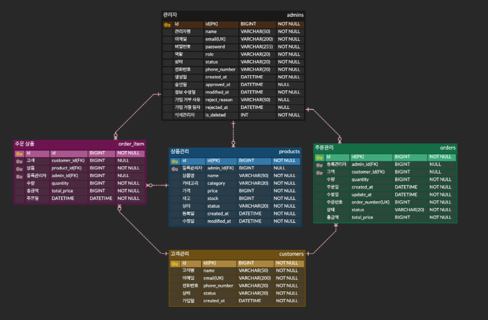

# 📦 11조 젓가락팀 - Spring 이커머스 백오피스 API
## 📌 프로젝트 소개

본 프로젝트는 Spring 기반으로 관리자, 고객, 상품, 주문을 통합 관리할 수 있는 이커머스 백오피스 API입니다.
실제 서비스 구조를 고려하여 3-Layer Architecture를 적용하고, JPA 기반으로 데이터베이스를 설계하여 백엔드 구조 전반을 학습하는 것을 목표로 합니다.
***
## 🏗️ 기술 스택
- Java
- Spring Boot
- Spring Data JPA
- MySQL
- Cookie / Session 기반 인증
- Gradle
***
## 📐 시스템 아키텍처
- Controller / Service / Repository 3-Layer 구조
- JPA 기반 객체 중심 데이터 관리
- Cookie + Session 인증 방식 적용
- 관리자 권한 및 상태 기반 접근 제어 구조 설계
***
## 👥 주요 기능
1. 관리자 관리
   - 관리자 회원가입 (승인 대기 상태)
   - 로그인 / 로그아웃 (Session 기반 인증)
   - 관리자 목록 조회 / 상세 조회
   - 관리자 정보 수정 / 삭제
   - 관리자 승인 / 거부 처리
   - 내 프로필 조회 및 수정
   - 비밀번호 변경
2. 고객 관리
   - 고객 목록 조회
   - 고객 상세 조회
   - 고객 정보 수정
   - 고객 상태 변경
   - 고객 삭제
3. 상품 관리
   - 상품 등록
   - 상품 목록 조회
   - 상품 상세 조회
   - 상품 정보 수정
   - 재고 관리 및 상태 자동 변경
   - 재고 0 → 품절
   - 재고 1 이상 → 판매중
   - 상품 삭제
4. 주문 관리
   - CS 주문 생성 (관리자 주문)
   - 주문 목록 조회
   - 주문 상세 조회
   - 주문 상태 변경 (준비중 → 배송중 → 배송완료)
   - 주문 취소
   - 취소 시 재고 자동 복구
   - 상품 상태 자동 반영
***
## 📑 API 명세서
https://www.notion.so/teamsparta/11-API-3512dc3ef514802fa46fcf5cdcc316cc?source=copy_link
***
## 📍 ERD

***
   ## 🔐 인증 및 권한
   - Session 기반 로그인 처리
   - HttpOnly Cookie 사용
   - 관리자 상태에 따른 로그인 제한
   - 승인대기 / 거부 / 정지 / 비활성 → 로그인 불가
   - (도전 기능) Role 기반 접근 제어 구조 고려
***
   ## ⚙️ 예외 처리 및 공통 응답
   - @RestControllerAdvice 기반 전역 예외 처리
   - Validation 적용 (이메일, 비밀번호, 전화번호 등)
   - 공통 Response 구조 적용
````
   {
   "status": 200,
   "message": "성공",
   "data": {}
   }
````
***
   ## 💡 주요 특징
   - 실제 서비스 흐름과 유사한 도메인 구조 설계
   - 상품 ↔ 주문 ↔ 재고 상태 자동 연동
   - 상태 기반 비즈니스 로직 구현
   - 계층형 아키텍처 기반 유지보수 구조
***
   ## ⚠️ 트러블슈팅
https://www.notion.so/teamsparta/Main-3522dc3ef51480e09dfbf325d95d8c71?source=copy_link
   ***
   ## 🎯 프로젝트 목적
   - 단순 CRUD가 아닌 실무형 백엔드 구조 이해
   - 데이터 흐름 및 상태 관리 로직 구현
   - 인증 / 예외처리 / 계층 구조 설계 경험